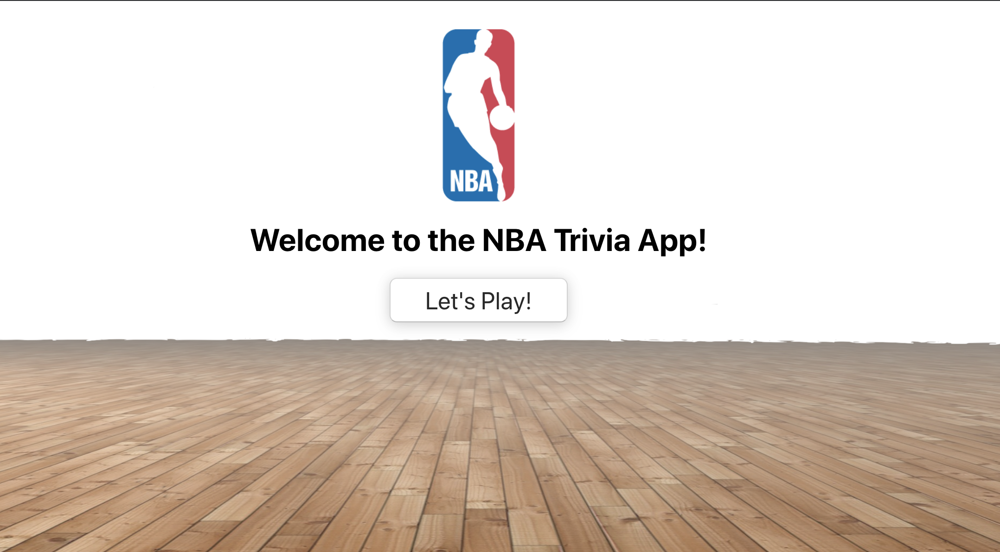

# NBA Trivia Frontend

Test your knowledge of the NBA with this trivia app. You get 10 shots to show your skills. Consider yourself a BALLER if you score 6 or above.

## Contents

- [Getting Started](#getting_started)
- [Built With](#built_with)
- [Versioning](#versioning)
- [Development](#development)
- [Demo](#demo)

## Getting Started

Fork and clone this repository. `cd` into directory. Run `npm install` to install dependencies. Run `npm start` for development server will be launched.

Ensure to run installation for backend for full application: [Back-End](https://github.com/itsjafah/nba-trivia-backend)

## Built With

Worked with React for frontend development. Used JSX, HTML, and custom CSS to create responsive layouts and animations.

## Versioning

* react version ^16.8.4
* npm version 6.7.0

## Development

Ideas for future features:

### Create Account

Allowing a user to create a profile to keep track of their high scores.

### SFX

Sounds for correct answers, incorrect answers, timer, and question transitions.

## Demo

[Demo](https://www.youtube.com/watch?v=OKuVfoo1TQc)
